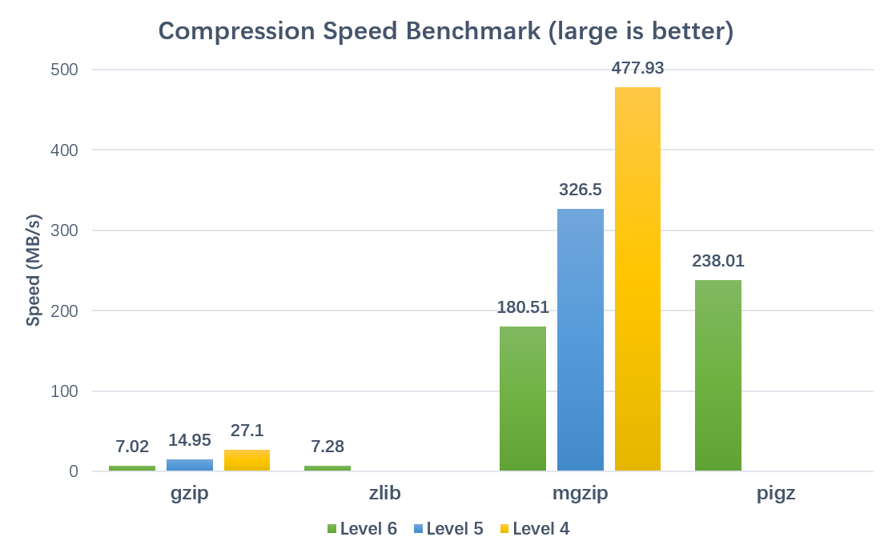
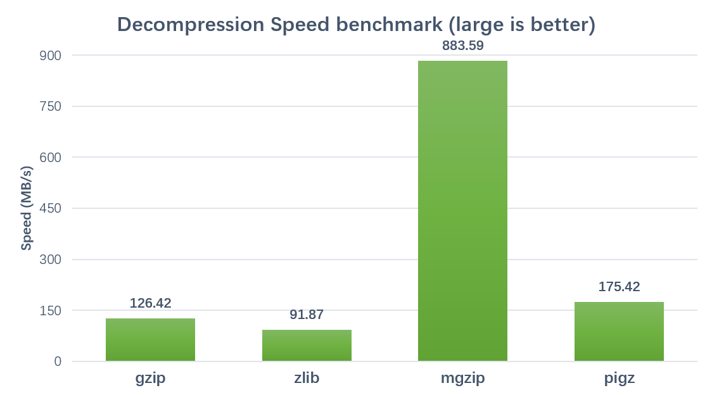

# mgzip
A multi-threading implement of Python gzip module

Using a block indexed GZIP file format to enable compress and decompress in parallel. This implement use 'FEXTRA' to record the index of compressed member, which is defined in offical GZIP file format specification version 4.3, so it is fully compatible with normal GZIP implement.

This module is **~25X** faster for compression and **~7X** faster for decompression (limited by IO and Python implementation) with a *24 CPUs* computer.

***In theoretical, compression and decompression acceleration should be linear according to the CPU cores. In fact, the performance is limited by IO and program language implementation.***

## Usage
Use same method as gzip module
```python
import mgzip

s = "a big string..."

## Use 8 threads to compress.
## None or 0 means using all CPUs (default)
## Compression block size is set to 200MB
with mgzip.open("test.txt.gz", "wt", thread=8, blocksize=2*10**8) as fw:
    fw.write(s)

with mgzip.open("test.txt.gz", "rt", thread=8) as fr:
    assert fr.read(len(s)) == s
```

## Performance
### Compression:


### Decompression:


*Brenchmarked on a 24 cores, 48 threads server (Xeon(R) CPU E5-2650 v4 @ 2.20GHz) with 8.0GB FASTQ text file.*

*Using parameters thread=42 and blocksize=200000000*

## Warning
**This package only replace the 'GzipFile' class and 'open', 'compress', 'decompress' functions of standard gzip module. It is not well tested for other class and function.**

**As the first release version, some features are not yet supported, such as seek() and tell(). Any contribution or improvement is appreciated.**
